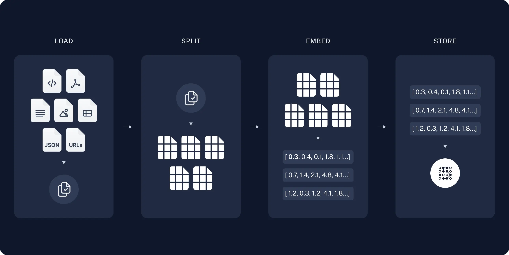
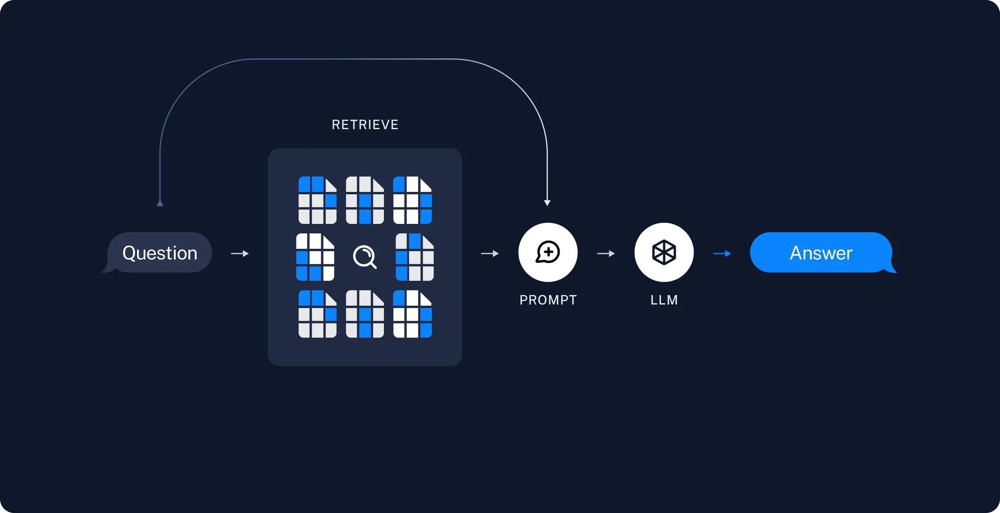

## Resumen 

Este informe detalla el desarrollo y evaluación de un chatbot basado en la técnica RAG (Retrieval-Augmented Generation). La aplicación fue desarrollada utilizando TypeScript y NextJS tanto para el frontend como para el backend, con la ayuda de la biblioteca Langchain y una base de datos Postgres con la extensión `pg-vector` para la gestión de vectores. A pesar de las limitaciones y errores observados, el chatbot representa un esfuerzo inicial en la implementación de un sistema de respuesta automática mejorado mediante la recuperación de información.

**Palabras Clave**: Chatbot, RAG, NextJS, TypeScript, Langchain, Postgres, pg-vector

## Problemática 

Las instituciones y específicamente sus profesionales enfrentan dificultades para estudiar documentos de forma eficiente debido al volumen y la complejidad de la información. Existen soluciones como ChatPDF, pero estas son de pago y privativas, lo que limita su accesibilidad y uso en entornos que requieren soluciones libres y abiertas.

## Homólogos

ChatGPT
ChatPDF
Humata

## ¿Qué es un RAG? 

RAG, o Retrieval-Augmented Generation, es una técnica que combina el conocimiento de los Modelos de Lenguaje Grande (LLMs) con datos adicionales para mejorar sus capacidades de respuesta. Aunque los LLMs son capaces de razonar sobre una amplia variedad de temas, su conocimiento está limitado a la información pública disponible hasta la fecha en la que fueron entrenados. Para crear aplicaciones de inteligencia artificial que puedan manejar datos privados o información reciente, es necesario aumentar el conocimiento del modelo con datos específicos pertinentes a la consulta del usuario. Este proceso, conocido como Retrieval-Augmented Generation, consiste en recuperar información relevante y presentarla al modelo para generar respuestas precisas.

### Arquitectura de RAG 

Una aplicación típica de RAG tiene dos componentes principales: 

**Indexación:** Es el proceso de ingerir los datos desde una fuente para que el modelo llm los procese y cargarlo a la base de datos. Incluye
	- carga de datos
	- division del contenido en fragmentos manejables
	- almacenamiento de estos fragmentos en una base de datos de vectores para la posterior búsqueda

**Recuperación y Generación:** Durante el tiempo de ejecución, este componente toma la consulta del usuario, recupera los fragmentos relevantes de la base de datos y utiliza un modelo de lenguaje para generar una respuesta basada en los datos recuperados.

[Q&A with RAG | 🦜️🔗 Langchain](https://js.langchain.com/v0.1/docs/use_cases/question_answering/)

### Proceso Completo 

El flujo típico de datos en una aplicación RAG desde los datos en bruto hasta la generación de respuestas se puede desglosar en los siguientes pasos:  

**Carga de Datos:** Utilizando cargadores de documentos para importar la información. 
**División de Textos:** Fragmentar grandes documentos en trozos más pequeños para facilitar su búsqueda y procesamiento. 
**Almacenamiento:** Utilizar un almacén de vectores y un modelo de embeddings para indexar y almacenar estos fragmentos.  

En el momento de la consulta: 
**Recuperación:** Utilizar un recuperador para buscar y obtener los fragmentos relevantes de la base de datos. 
**Generación:** Un modelo de lenguaje grande produce una respuesta basada en la consulta del usuario y los datos recuperados.  Esta combinación de recuperación y generación permite que las aplicaciones RAG proporcionen respuestas contextualmente adecuadas y precisas, mejorando significativamente la interacción con el usuario.

## Propuesta de Solución 

Nuestra propuesta consiste en desarrollar un chatbot basado en RAG utilizando tecnologías de código abierto. La aplicación fue desarrollada con TypeScript y NextJS, utilizando Langchain para la generación de lenguaje natural y una base de datos Postgres con `pg-vector` para la gestión de vectores. Este enfoque permite a las instituciones acceder a una herramienta eficiente y gratuita para el estudio de documentos.

## Descripción Detallada de la Solución

### Tecnologías Utilizadas

- **Lenguaje de Programación:** TypeScript.
- **Frameworks:** NextJS para el desarrollo del frontend y backend.
- **Bibliotecas:** Langchain como framework para trabajar con modelos LLM.
- **Base de Datos:** Postgres con `pg-vector` para el manejo de vectores.
- **Modelo de AI:** Llama2 como modelo haciendo uso de Ollama para correr el modelo.

### Desarrollo y Entrenamiento

El desarrollo del chatbot incluye:

- **Recopilación de Archivos:** Se reunieron los documentos necesarios para alimentar la base de datos.
- **Generación de Vectores de Embeddings:** Utilizando un modelo de embeddings preentrenado, se generaron los vectores correspondientes a los documentos y se almacenaron en la base de datos Postgres con `pg-vector`.
- **Integración Inicial:** Implementación de una versión funcional del chatbot para pruebas y ajustes iniciales.

## Pruebas

### Resultados de las Pruebas 

Las pruebas iniciales revelaron varios errores, incluyendo:
- **Pérdida de Contexto:** El chatbot a veces salía del contexto de la conversación.
- **Respuestas Incorrectas:** En varias ocasiones, las respuestas generadas no eran correctas o relevantes.

## Desafíos y Dificultades 

Durante el desarrollo, se encontraron varios desafíos: 

- **Integración de Módulos:** Asegurar que la recuperación de información y la generación de respuestas funcionaran de manera coherente. 
- **Precisión de Respuestas:** Sin el uso de técnicas avanzadas como el reranking, la precisión de las respuestas fue limitada. 
- **Errores en la Respuesta:** Se observaron errores frecuentes, lo que indica la necesidad de un proceso de pruebas y optimización más riguroso.

## Conclusiones 

El chatbot RAG desarrollado representa un paso inicial hacia la mejora de la interacción automatizada con usuarios. A pesar de los errores y limitaciones, el proyecto proporciona una base sobre la cual se pueden realizar mejoras futuras, tales como: - **Implementación de Técnicas Avanzadas de Recuperación:** Incorporar métodos como el reranking, búsqueda semántica y un sistema de feedback. - **Mejorar el Contexto:** Haciendo uso de una memoria de la conversación. - **Pruebas Exhaustivas:** Realizar pruebas más detalladas para identificar y corregir errores. - **Optimización de Modelos:** Mejorar la precisión y relevancia de las respuestas mediante el ajuste y la optimización de los modelos de generación.

## Referencias

- Langchain Documentation: [langchain docs]([langchain 0.2.5 — 🦜🔗 LangChain 0.2.5](https://js.langchain.com/))
- NextJS Documentation: https://nextjs.org/docs
- PostgreSQL with pg-vector: [https://github.com/pgvector/pgvector](https://github.com/pgvector/pgvector)
