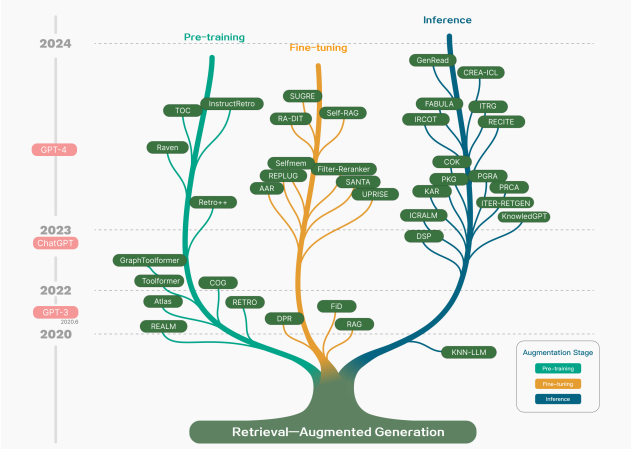
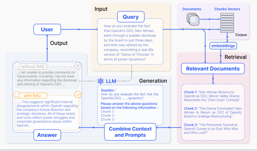
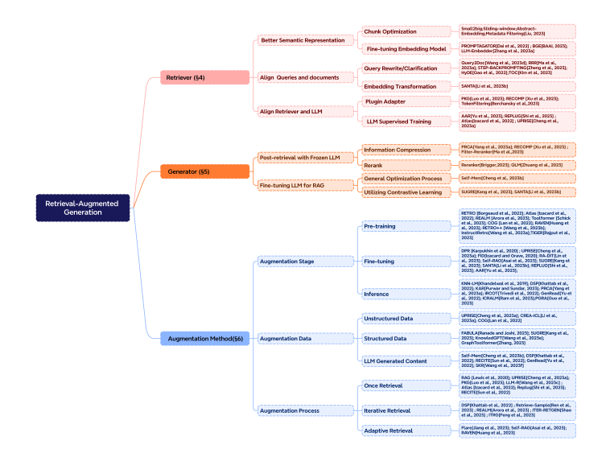

## Recopilación de información sobre RAG 
## ¿Qué es un RAG?

La Generación Aumentada por Recuperación (RAG, por sus siglas en inglés) es un marco de trabajo avanzado de Inteligencia Artificial (IA) que combina la recuperación de información con la generación de texto. Este proceso optimiza la salida de un modelo de lenguaje grande (LLM, por sus siglas en inglés), de modo que hace referencia a una base de conocimientos autorizada fuera de sus fuentes de datos de entrenamiento antes de generar una respuesta.

Los LLMs se entrenan en grandes volúmenes de datos y utilizan miles de millones de parámetros para generar una salida original para tareas como responder preguntas, traducir idiomas y completar frases. RAG amplía las ya poderosas capacidades de los LLMs a dominios específicos o a la base de conocimientos interna de una organización, todo sin la necesidad de reentrenar el modelo.

RAG es importante porque los LLMs son una tecnología clave de IA que impulsa los chatbots inteligentes y otras aplicaciones de procesamiento de lenguaje natural (NLP, por sus siglas en inglés). El objetivo es crear bots que puedan responder a las preguntas de los usuarios en varios contextos mediante la referencia cruzada de fuentes de conocimiento autorizadas.

Desafortunadamente, la naturaleza de la tecnología LLM introduce imprevisibilidad en las respuestas de los LLMs. Además, los datos de entrenamiento de los LLMs son estáticos e introducen una fecha de corte en el conocimiento que poseen. Algunos de los desafíos conocidos de los LLMs incluyen: presentar información falsa cuando no tienen la respuesta, presentar información desactualizada o genérica cuando el usuario espera una respuesta específica y actual, crear una respuesta a partir de fuentes no autorizadas, y crear respuestas inexactas debido a la confusión de terminología.

RAG es un enfoque para resolver algunos de estos desafíos. Redirige el LLM para recuperar información relevante de fuentes de conocimiento autorizadas y predefinidas. Las organizaciones tienen un mayor control sobre el texto generado, y los usuarios obtienen información sobre cómo el LLM genera la respuesta.

## Flujo de trabajo clásico de un RAG 

1. Indexar : La librería de documentos se divide en pedazos más pequeños y los vectores de los indices son construidos usando un decodificador. 
2. Recuperador: los snippets de los documentos relevantes son recuperados basándose en la similaridad con la pregunta dada y los pedazos definidos previamente.
3. Generación: Usando el contexto del recuperador como una condición, la repuesta a la pregunta es generada.

## Retriever (Recuperador) 

En un RAG es crucial recuperar numerosos documentos de la base de datos, haciendo el proceso de recuperación extremadamente importante, sin embargo el proceso de desarrollo de un recuperador representa un reto significativo.

### Mejor representación semántica

En un RAG, el espacio semántico se refiere al espacio multidimensional en donde las peticiones y los documentos son mapeados. La recuperación dentro de este espacio semántico es fundamental y su precisión afecta significativamente los resultados del RAG, por lo que es importante tener en cuenta dos métodos para tratar una recuperación adecuada y precisa:

* Chunk Optimization 
* *OJO*

### Alinear la petición con el documento 

En las aplicaciones RAG algunos recuperadores usan unos un solo modelo de embedding para codificar la petición y los documentos al mismo tiempo, mientras otros emplean dos modelos separados. Es necesario procesar la petición correctamente para alinearlo con los documentos ya que el usuario podría introducir errores de lenguaje, frases imprecisas o información insuficiente, para ellos tenemos en cuenta dos técnicas diseñadas para alcanzar este objetivo.

 * Reescritura de la petición
 * Transformación de embedding

### Alinear el recuperador con el LLM
Al incorporar los distintos métodos anteriormente relacionados no necesariamente se traduce en una salida final mejorada para el RAG, dado que los documentos recuperados pueden no estar alineados con los requerimientos del LLM, para ello se mencionan dos métodos para alinear las salidas del recuperador con las preferencias del modelo del lenguaje:

* Entrenamiento supervisado del LLM
* Conectar un adaptador

## Generador

El generador en es crucial en un RAG, es responsable de transformar la información recuperada en texto fluido y coherente, se distingue de los modelos generativos estándar por precisamente la recuperación de información adicional de interés y este generador es dirigido por el texto recuperado para asegurar una coherencia entre el contenido y la información que se devuelve.

### Procesamiento Post-recuperación

envuelve un tratamiento exhaustivo, filtrado, optimización de información recuperada de una larga base de datos repleta de documentos.

### Compresión de la información
Uno de los mayores retos es manejar una cantidad sustancial de información de una base de conocimiento, algunas investigaciones apuntan a extender el tamaño del contexto del LLM, de igual forma los modelos actuales trabaja con limitaciones de contexto, por lo que hay situaciones donde la condensación de información se vuelve imperativa. En esencia , el significado de la condensación de la información manifiesta en los siguientes aspectos: reducción del ruido, restricción de tamaño de contexto y efectos de generación aumentada.

### Fine-tuning el LLM

Es un aspecto crucial optimizar el generador. En tareas estándar de generación LLM, la entrada usualmente consiste en una petición. La adición de información extra que caracteriza a los RAG pueden influenciar el entendimiento del modelo, particularmente los modelos pequeños. En estos casos realizar fine-tuning del modelo para adaptar la entrada de ambos, petición y documentos recuperados se vuelve crucial.

## Aumento
Tenemos tres aspectos claves:

* La etapa de aumento
* Las fuentes de datos de aumento
* El proceso de aumento

